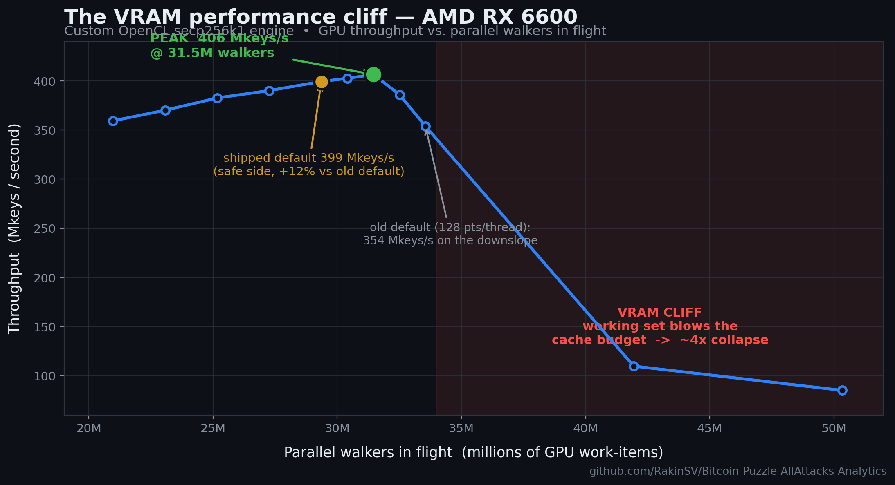
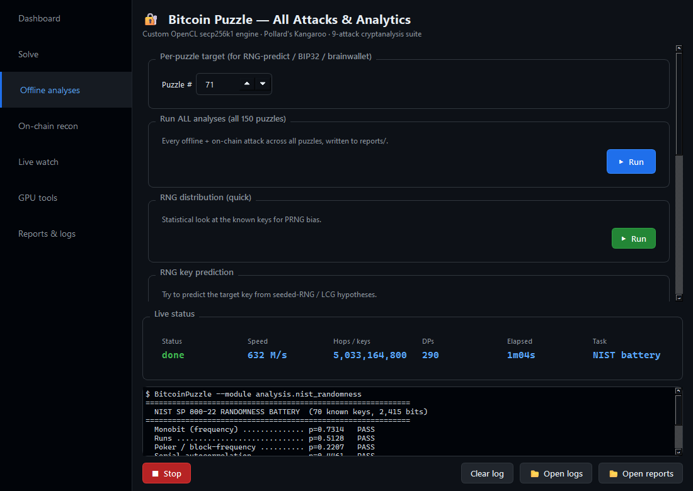
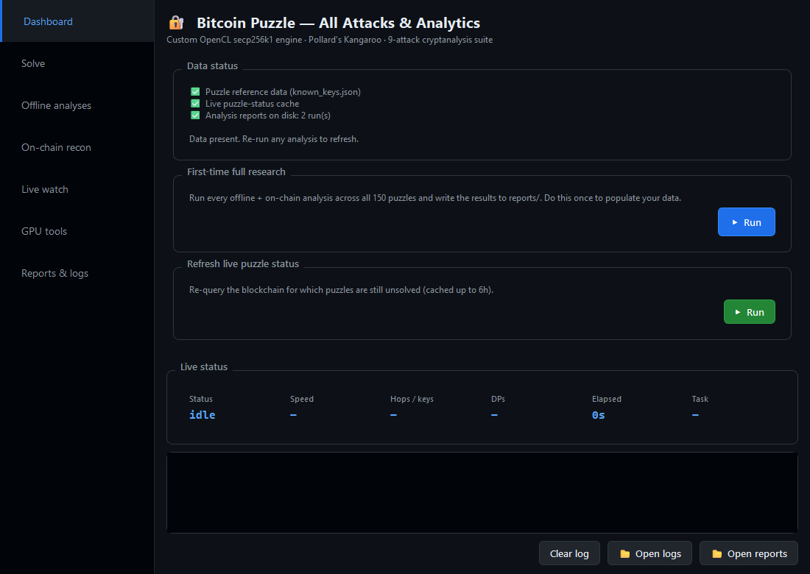
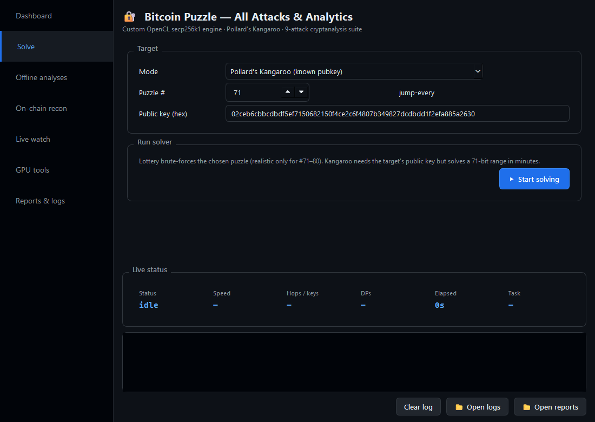
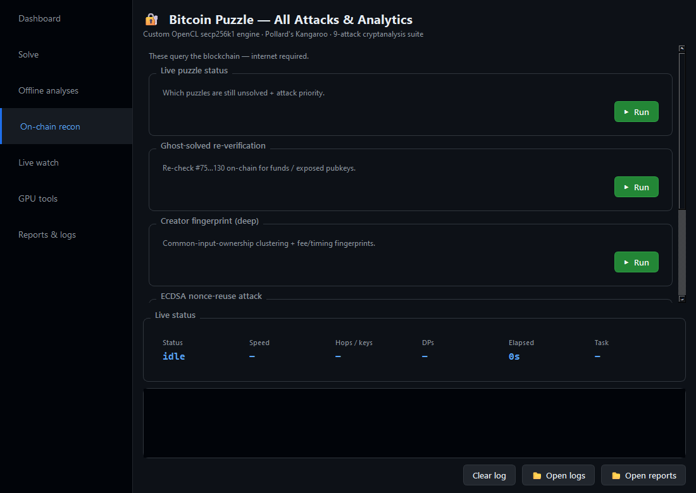
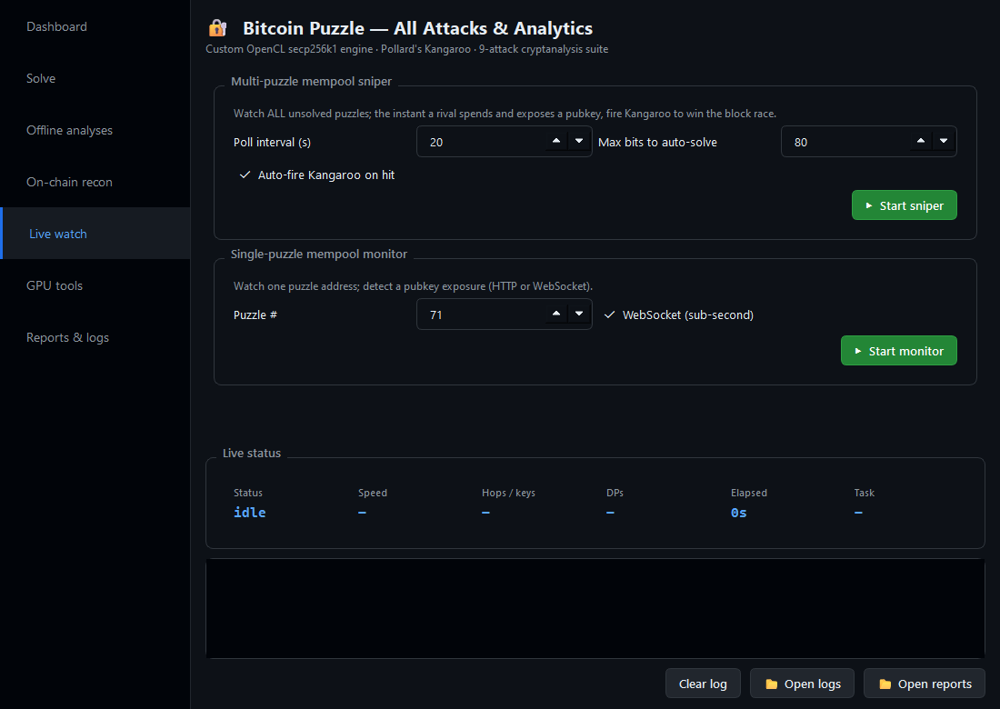
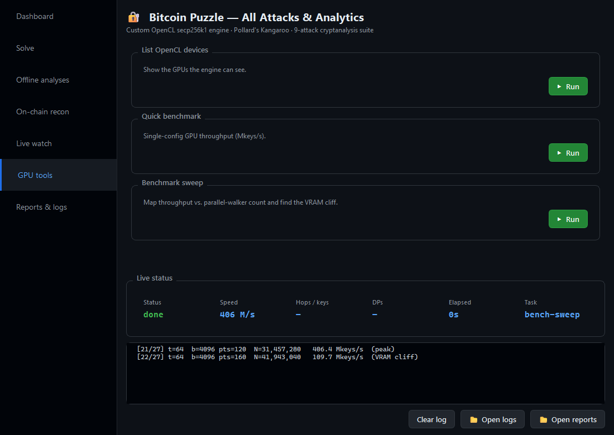

# Bitcoin Puzzle — All Attacks & Analytics

A from-scratch research toolkit for the [Bitcoin Puzzle Transaction](https://privatekeys.pw/puzzles/bitcoin-puzzle-tx) — a 1000-key challenge where puzzle **#N** hides a private key in the interval `[2^(N-1), 2^N)`. This repo treats the puzzle as what it really is: an applied exercise in **elliptic-curve cryptography, parallel algorithms, GPU compute, and statistical cryptanalysis** — and attacks it from every honest angle at once.

It is also a study in **intellectual honesty**. Most of the "shortcuts" people dream up for these puzzles don't exist, and this toolkit *proves* they don't — with real tests, real p-values, and real on-chain evidence — instead of hand-waving. Negative results, rigorously obtained, are still results.

> **Status:** the GPU engine, the full attack suite, and the analytics pipeline are complete and tested (31 unit tests pass). No puzzle key is "solved" here by magic — the creator used genuine randomness, and this repo demonstrates *why* the only viable routes are brute force, Pollard's Kangaroo on an exposed public key, and mempool sniping.

## 📖 Documentation

A full project wiki lives in [`docs/wiki/`](docs/wiki/Home.md):

- [Architecture](docs/wiki/Architecture.md) — codebase layout & the one-binary GUI/worker model
- [GPU Kangaroo Engine](docs/wiki/GPU-Kangaroo-Engine.md) — the OpenCL kernel, optimizations, and the VRAM cliff
- [Attacks & Theories](docs/wiki/Attacks-and-Theories.md) — the nine attacks and their verdicts
- [Desktop App](docs/wiki/Desktop-App.md) — the GUI, packaging, and CI
- [Problems & Solutions](docs/wiki/Problems-and-Solutions.md) — the real engineering war stories
- [Future Ideas](docs/wiki/Future-Ideas.md) — where this could go next

---

## Why this is interesting

Solving puzzle #71 (a 71-bit key, ~7.1 BTC at stake) by blind brute force on a single consumer GPU would take on the order of **tens of thousands of years**. So the interesting work is *not* "spin a brute-forcer" — it's:

1. **Can the keys be predicted?** If the creator used a weak RNG, an HD-wallet seed, a brainwallet passphrase, or reused an ECDSA nonce, the key falls in milliseconds. → *A battery of attacks that each test one hypothesis and falsify it with evidence.*
2. **Can we exploit an exposed public key?** The moment anyone spends from a puzzle address, its public key hits the mempool. With a known pubkey, the problem collapses *in theory* from a 2^71 search to a **2^35.5 Pollard's Kangaroo walk**. → *A custom GPU Kangaroo engine + a live mempool sniper.* **In practice the engine currently only converges below ~37 bits — see the known issue below.**
3. **How fast can a single RX 6600 actually go?** → *A hand-written OpenCL secp256k1 kernel, profiled and tuned to the metal.*

---

## Architecture at a glance

```
ecc/                 secp256k1 from scratch — field, curve, GLV endomorphism
kangaroo/            Pollard's Kangaroo: CPU reference + custom OpenCL GPU engine
  gpu_kangaroo.cl      hand-written secp256k1 kernel (Jacobian, deferred inversion)
  kangaroo_engine.py   GPU orchestrator (3-herd tame/wild/neg, distinguished points)
  gpu_search.py        brute-force / BSGS GPU mode + benchmarking
analysis/            nine independent cryptanalytic attacks (see docs/THEORIES.md)
utils/               puzzle registry (all 150), address derivation, DP table, checkpoints
monitor.py           live mempool watcher (HTTP + WebSocket, <1s pubkey detection)
multi_sniper.py      watch ALL unsolved puzzles, snipe a competitor's pubkey, auto-fire Kangaroo
run_all_analyses.py  one command -> every analysis over all 150 puzzles -> reports/
main.py              unified CLI (gpu | cpu | kangaroo, any puzzle, bench, status)
```

Everything is pure **Python 3** + **PyOpenCL**. No `scipy`, no heavyweight ML stack — the statistics (including the regularized incomplete gamma function behind every chi-square p-value) are implemented by hand.

---

## The cryptography & algorithms

### secp256k1, built from the field up (`ecc/`)
- Prime-field arithmetic mod `P = 2^256 − 2^32 − 977`, fast reduction exploiting the special form of `P`.
- Full curve group: point addition, doubling, scalar multiplication, point negation.
- **GLV endomorphism** (`glv.py`): the secp256k1 endomorphism `φ(x,y) = (βx, y)` acts as multiplication by `λ`, letting a scalar `k` be split into two ~128-bit halves `k = k1 + k2·λ`. Implemented for host-side scalar-mul speedups — with an honest note in the code that it does **not** accelerate *interval* Kangaroo (a common misconception worth documenting).

### Pollard's Kangaroo — the real weapon (`kangaroo/`)
The discrete-log-in-an-interval problem: given `Q = k·G` with `k ∈ [a, b]`, recover `k` in `~2·√(b−a)` group operations instead of `b−a`. Our implementation includes every optimization that matters:

- **Three herds** — tame, wild, and **negated-wild**. The negation map (`(x,y) → (x,−y)`) folds the search space in half for a **√2 speedup**, essentially free on secp256k1.
- **Jacobian coordinates** — point hops cost **11 field multiplications** instead of the ~258 of a naive affine addition (which needs a modular inversion every hop).
- **Deferred / amortized inversion** — inversion (the single most expensive field op, ~255 squarings via Fermat) is done **once per 2048 hops** by batching the affine conversion. Tuning this batch size was worth a measured **+6%**.
- **Distinguished Points** — trails are recorded only at points whose x-coordinate has `dp_bits` trailing zero bits; the DP-bit budget is **auto-tuned** to the herd size to keep the GPU output buffer from overflowing.
- **Jump table in local memory (LDS)** — the precomputed jump points live in on-chip shared memory, not global VRAM.

Measured: **~631 Mhop/s sustained on an AMD RX 6600** (raw hop throughput).

> ### ✅ Solves to ~58 bits on one RX 6600 (verified end-to-end)
> Recovered against real public keys:
> **#42 ~17s · #45 ~4s · #50 ~10s · #55 ~70s · #58 ~5 min.** The old engine
> stalled above ~40 bits; it now scales cleanly to ~58.
>
> Two root causes were found and fixed (see [issue #1](https://github.com/RakinSV/Bitcoin-Puzzle-AllAttacks-Analytics/issues/1)):
> 1. **Key reconstruction.** A distinguished point stores only the x-coordinate
>    (shared by `P` and `-P`), so a collision means the discrete logs agree *up to
>    sign*; the host applied one formula per herd pair and produced garbage keys.
>    Now modelled as `a·k + b` with the ± ambiguity resolved.
> 2. **Herd geometry.** Both herds started *clustered* at two points, giving no
>    √-parallelism (work grew as `n_total·√W`). Now both herds are **spread
>    randomly** across the interval — validated in a from-scratch herd model to give
>    bounded ~`10·√W` work, the design JeanLucPons uses.
>
> Offset points are now built **on the GPU** (`off·G` by summing a `2^j·G` table
> over set bits), so init stays ~0.1s even for the default 8192-kangaroo herd —
> which saturates the GPU and cuts variance.
>
> **Further speed (optional):** **Montgomery batch inversion** across the herd
> (per-hop, phase-independent DP) would raise the hop-rate and push a few bits
> higher. A 71-bit key is **not** solvable on one consumer GPU regardless — that
> needs a distinguished-point pool across many machines; any earlier
> "2–3 minutes" claim was hop-rate extrapolation, never verified.

### A hand-written OpenCL secp256k1 kernel (`kangaroo/gpu_kangaroo.cl`)
This is the centerpiece. 256-bit modular arithmetic, written for GPUs that have no native big-int support:
- 32×32→64 multiplies via `mul_hi` / `mad_hi`, with the secp256k1 fast reduction (`lo += hi·(2^32+977)`).
- `#pragma unroll` on the 8-limb carry chains; mixed Jacobian addition; Fermat inversion.
- Ported the proven `mulModP` reduction from BitCrack and re-verified it against a CPU reference.

### GPU performance engineering — finding the cliff
A parameter sweep across `threads × blocks × points/thread` revealed something the textbook doesn't mention: a **hard VRAM "performance cliff."** On the 8 GB RX 6600, throughput climbs smoothly to a peak around **31M work-items (~406 Mkeys/s)** — then, just past **~33M**, it **collapses by ~4×** (to ~110 Mkeys/s) as the working set blows the cache/allocator budget. The shipped defaults were sitting *past* the peak on the downslope; re-tuning to the safe side of the cliff was a free **+12%**. The bundled `--bench-sweep` now maps the curve and refuses to bench guaranteed-loser configs.



---

## The attack & analytics suite

Nine independent attacks, each one a falsifiable hypothesis about how the keys *might* be weak. Full write-ups — methodology, math, and verdict — are in **[docs/THEORIES.md](docs/THEORIES.md)**. In brief:

| # | Attack | Hypothesis it tests | Tooling |
|---|--------|--------------------|---------|
| 1 | **RNG analysis & prediction** | Keys came from a seeded PRNG (Mersenne Twister / LCG) | seed search, distribution stats |
| 2 | **BIP32 / HD-wallet** | Keys are children of one master seed (`m/0/N`) | derivation-path testing |
| 3 | **Brainwallet dictionary** | `privkey = SHA256(passphrase)` | validated wordlist attack |
| 4 | **ECDSA nonce reuse** | The creator reused/leaked a signing nonce `k` | lattice / LLL on signatures |
| 5 | **Pubkey EC-point patterns** | Public keys are linearly/multiplicatively related | on-chain pubkey harvesting |
| 6 | **Creator fingerprinting** | Which keys share one owner | **common-input-ownership** (cryptographic proof) + fee/timing heuristics |
| 7 | **NIST SP 800-22 battery** | The key bits are non-random | Monobit, Runs, Poker, Autocorrelation, χ² — real p-values |
| 8 | **Ghost-solved re-verification** | A "solved" puzzle still holds BTC / exposed a pubkey | direct blockchain re-check |
| 9 | **Multi-puzzle mempool sniper** | Win the race when a rival exposes a pubkey | WebSocket watcher + pre-warmed Kangaroo |

**The honest verdict across all nine:** the creator used real randomness. Every statistical test passes (p ≥ 0.01), no RNG/HD/brainwallet/nonce shortcut exists, and the only keys with exposed public keys (#125, #130) are far beyond a single GPU's reach. That *negative* result is the most valuable output here — it tells you exactly where **not** to waste 35,000 GPU-years.

---

## Desktop app

There's a native desktop GUI (PySide6/Qt) — pick a puzzle, choose a mode
(GPU lottery / Kangaroo / full analysis sweep), and watch live throughput, hops,
distinguished points, and the log stream in real time. No terminal required.



| Dashboard | Solve | On-chain recon |
|---|---|---|
|  |  |  |
| **Live watch** | **GPU tools** | |
|  |  | |

Every action streams its output to the panel **and** to `logs/<timestamp>_<task>.log`.
The action's own button turns into a **Stop** while it runs. On first launch with
no data, the app offers to research everything (full sweep over all 150 puzzles).

**Download a prebuilt bundle** (no Python needed — you only need your GPU's
OpenCL driver installed) from the [Releases page](https://github.com/RakinSV/Bitcoin-Puzzle-AllAttacks-Analytics/releases):
Windows `.zip` and Linux `.tar.gz`, built automatically by GitHub Actions.

Run from source instead:

```bash
pip install PySide6 pyopencl numpy requests
python app_entry.py          # or: RUN_APP.bat on Windows
```

## Quick start (CLI / batch)

```bash
pip install pyopencl numpy requests
python tests/test_ecc.py && python tests/test_kangaroo.py && python tests/test_gpu.py   # 31 tests
```

Windows users get one-click batch files:

| Batch file | What it does |
|------------|--------------|
| `RUN_APP.bat` | **Launch the desktop app** (PySide6 GUI) |
| `RUN_EVERYTHING.bat` | **Run every analysis over all 150 puzzles, straight to `reports/`** (no params) |
| `START_LOTTERY.bat` | GPU brute-force lottery — **prompts for which puzzle** to attack |
| `CHOOSE_PUZZLE.bat` | Live unsolved-puzzle list + pick a target |
| `RUN_MULTI_SNIPER.bat` | Watch all unsolved puzzles; snipe an exposed pubkey and auto-fire Kangaroo |
| `RUN_ALL_SMART_ATTACKS.bat` | Interactive menu for every individual attack |

Or drive the CLI directly:

```bash
# Brute-force lottery on any puzzle
python main.py --puzzle 71 --mode gpu --pure-random --pool-avoid

# Pollard's Kangaroo against a known public key (verified for small intervals only - see known issue)
python main.py --puzzle 71 --mode kangaroo --pubkey 02....

# Map your GPU's throughput curve and find the VRAM cliff
python main.py --bench-sweep
```

---

## What this project demonstrates

- **Cryptography:** secp256k1 from first principles, ECDLP, Pollard's Kangaroo, GLV endomorphism, ECDSA nonce-reuse / lattice attacks, BIP32 derivation, brainwallets.
- **Parallel & GPU programming:** a hand-written OpenCL big-integer kernel, occupancy/throughput tuning on RDNA2, discovering and dodging a VRAM performance cliff, distinguished-point trail algorithms.
- **Applied statistics:** the full NIST SP 800-22 randomness battery with hand-rolled χ² p-values (regularized incomplete gamma, no scipy).
- **On-chain forensics:** common-input-ownership clustering as cryptographic proof of shared control; live mempool monitoring over WebSockets.
- **Software engineering:** a clean, tested, generalized codebase (all 150 puzzles, three solver modes, crash-safe checkpointing) and a one-command reporting pipeline.

See **[docs/THEORIES.md](docs/THEORIES.md)** for the deep dive on every theory tested and why each one held or failed.

---

## Disclaimer & ethics

The Bitcoin Puzzle is a **public, intentional challenge**: the creator funded these addresses specifically to be solved, and claiming a key you find is the explicit point of the game. This repository is for **education and security research**. It contains no stolen data, no private keys to anyone's funds, and no malware. Be a good citizen — and never run a brute-forcer against an address that isn't part of the public puzzle.

## License

MIT — see [LICENSE](LICENSE).
